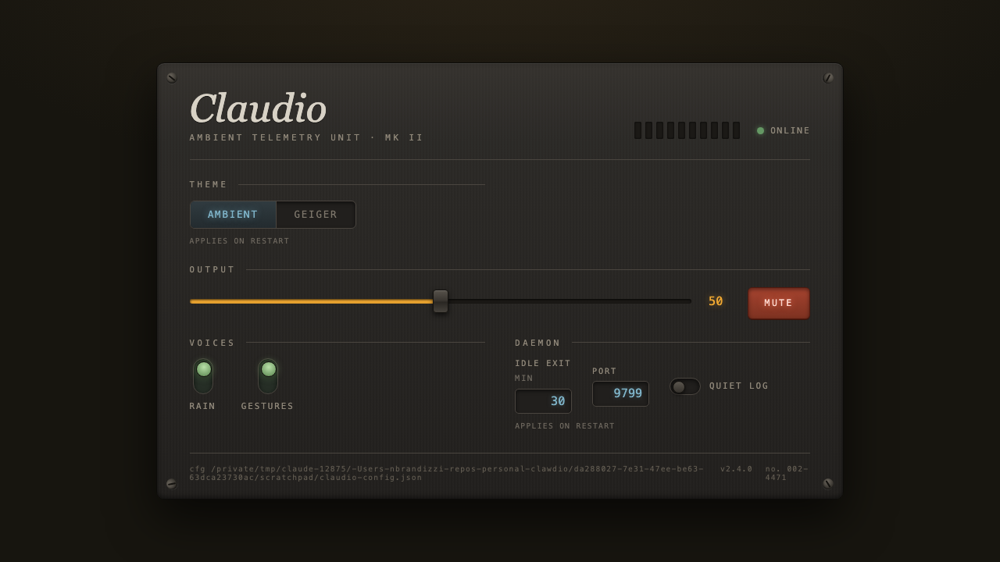

# Claudio

[](https://github.com/nicofirst1/Claudio/actions/workflows/ci.yml)

_Hear what a Claude Code session is doing without watching the terminal._

---

Claudio is a local audio daemon. Claude Code hook events (tool calls, subagents, failures, compaction, context pressure) arrive over UDP or HTTP on port 9753 and become a generative ambient soundscape: a pad that breathes, rain that thickens when busy, a wooden knock on failure, a descending chime on stop. Research prototype, formerly claude-geiger. Needs python3 + numpy + scipy; `sounddevice` only for live playback.

The sound layer is a swappable **theme** (`CLAUDIO_THEME`; see [Themes](#themes)).

Multiple Claude Code sessions can share one daemon: events blend into the same room, which only fades to silence once the last session ends, and each session's gestures get their own pan/pitch (`docs/research/BRIEF-v2.5.md`).

## Quickstart

```bash
uv run src/main.py --check    # zero setup: prints config + capability JSON
python3 src/main.py           # live: bind port 9753, play audio (needs sounddevice)
```

`uv run` reads the PEP 723 header and builds a venv on the fly, so `--check` needs nothing installed. For live audio, install deps below and let Claude Code start the daemon.

## Install (for AI agents)

Each step: a command, a success signal.

1. **Confirm it runs.**

   ```bash
   uv run src/main.py --check
   ```

   Success: JSON, exit 0, `"port": 9753`, `"theme": "ambient"` (`"audio_device_available": false` OK headless).

2. **Install the Python deps.**

   ```bash
   python3 -m pip install -r requirements.txt   # numpy, scipy, sounddevice
   ```

   Success: exit 0.

3. **Wire the hooks in.**

   ```bash
   ./install.sh --project --yes    # this repo's .claude/settings.json only
   ./install.sh --global --yes     # $CLAUDE_CONFIG_DIR/settings.json (or ~/.claude), every project
   ./install.sh --project --dry-run    # preview only, changes nothing
   ```

   Hard-fails if numpy is missing; backs up `settings.json`; merges additively, no-op on re-run. Success: `merged hooks into <path>` or `already up to date`.

4. **Re-check the boot config.**

   ```bash
   python3 src/main.py --check
   ```

   Success: exit 0, `"theme"`/`"port"` match intent.

5. **Smoke-test offline.**

   ```bash
   python3 src/main.py --render demos/demo-session-v2.jsonl /tmp/smoke.wav --seed 7
   ```

   Success: `rendered N events -> /tmp/smoke.wav`, exit 0, a WAV on disk.

`SessionStart` launches the daemon if 9753 doesn't answer; every other hook fires UDP at it. Undo: [Uninstall](#uninstall).

## HTTP and UDP surface

Binds `0.0.0.0:CLAUDIO_PORT` (9753), HTTP and UDP.

| Endpoint        | Scope         | What it does                                   |
| --------------- | ------------- | ---------------------------------------------- |
| `POST /event`   | LAN-open      | Raw hook JSON, always `200`, bad JSON dropped. |
| UDP datagram    | LAN-open      | Same JSON, same port; used by `send-event.sh`. |
| `GET /health`   | LAN-open      | `{"ok": true, "activity": <float>}`            |
| `GET /config`   | loopback only | Current config, which keys need a restart.     |
| `POST /config`  | loopback only | Merge config keys; live ones apply at once.    |
| `POST /restart` | loopback only | Re-exec in place; picks up code edits.         |
| `GET /`         | loopback only | Web control panel at `http://127.0.0.1:9753/`. |



## Config

Every knob is an env var; a config file (written by the web panel) **overrides** it.

| Var                      | Default                         | Meaning                                             |
| ------------------------ | ------------------------------- | --------------------------------------------------- |
| `CLAUDIO_THEME`         | `ambient`                       | `ambient` (v2) or `geiger` (legacy v1)              |
| `CLAUDIO_PORT`          | `9753`                          | UDP/HTTP listen port                                |
| `CLAUDIO_VOLUME`        | `0.5`                           | master volume 0.0-1.0                               |
| `CLAUDIO_MUTE`          | off                             | mute output, daemon keeps running                   |
| `CLAUDIO_IDLE_EXIT_MIN` | `30`                            | minutes of silence before daemon exits              |
| `CLAUDIO_CLICKS`        | on                              | `geiger` click train / `ambient` rain layer         |
| `CLAUDIO_CHIMES`        | on                              | `geiger` chimes / `ambient` knock-cadence-chime-ack |
| `CLAUDIO_DRONE`         | off                             | `geiger` pressure drone; unused in `ambient`        |
| `CLAUDIO_QUIET`         | off                             | suppress per-event stderr logging                   |
| `CLAUDIO_LOG_DIR`       | `$TMPDIR` or `/tmp`             | where autostart writes `sonifier.log`               |
| `CLAUDIO_LOG_LEVEL`     | `INFO`                          | DEBUG/INFO/WARNING/ERROR                            |
| `CLAUDIO_LOG_FILE`      | unset                           | rotating debug log path (2 MB x 3)                  |
| `CLAUDIO_CONFIG`        | `~/.config/claudio/config.json` | override config file path                           |
| `CLAUDIO_THEME_PACK`    | unset                           | ambient theme pack name (restart key; see below)    |

Booleans: off for `0`/`false`/`off`/`no`, on otherwise.

## Themes

`ambient` (default): bed pad, rain, melodic bloom, subagent stems, context-pressure drone, one Freeverb room. Failure = wooden knock; `Stop` = descending cadence; `Notification` = chime. Full spec: `docs/research/BRIEF-v2*.md`.

`geiger` (legacy v1, no scipy): Poisson click train tracking activity, read/write/exec timbres, failure/Stop tones.

`ambient` also takes a **theme pack**: a small JSON file that overrides a whitelisted set of sound constants, no code changes. `dusk` (darker, slower) and `porcelain` (brighter, sparser) ship in `themes/`. Select with `CLAUDIO_THEME_PACK`, `theme_pack` in the config file, or the web panel. Details and the full field table: `docs/THEMES.md`.

## Offline render and demos

```bash
python3 src/main.py --render events.jsonl out.wav --seed 7   # 48kHz stereo WAV, fixed RNG
```

`events.jsonl`: one JSON object per line, `{"t": <seconds>, "event": {<hook JSON>}}`; duration = last `t` + 3s tail. Four demos ship in `demos/`, from a full storyboard to a v1/geiger clip.

```bash
python3 src/simulate_session.py --emit-jsonl my-session.jsonl   # or write your own script
python3 src/simulate_session.py --speed 4    # fire a session at a running daemon, 4x realtime
```

## Tests and tooling

```bash
python3 -m pytest tests/ -q                        # 164 tests, deliberately lenient (no RNG flakiness)
python3 tools/lab.py steady 60                     # render + strict metric battery
python3 tools/analyze_render.py out.wav --arc      # PASS/FAIL vs BRIEF section-7 criteria
python3 tools/complaint_checks.py out.wav \
        --events demos/realistic-session.jsonl     # regression checks for known listener complaints
```

Spec-driven: specs in `docs/research/BRIEF-v2*.md`, design history in `docs/PROJECT.md`.

## Uninstall

```bash
./install.sh --uninstall --project    # or --global, same scope as install
pkill -f main.py                  # or let it idle-exit (CLAUDIO_IDLE_EXIT_MIN)
```

Removes only this repo's hook entries, no-op if nothing to remove.

## Feedback

[Listening feedback](../../issues/new?template=listening-feedback.yml) (how it sounds), [bug report](../../issues/new?template=bug-report.yml) (crashes). Include the version (`--check`).

## License

[MIT](LICENSE).
